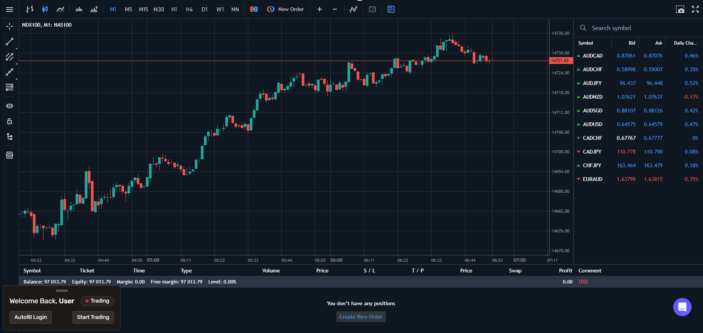
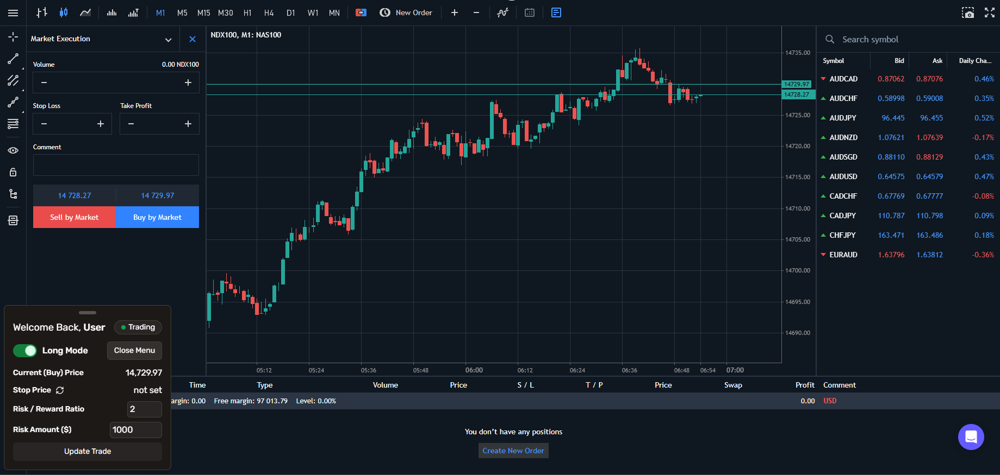
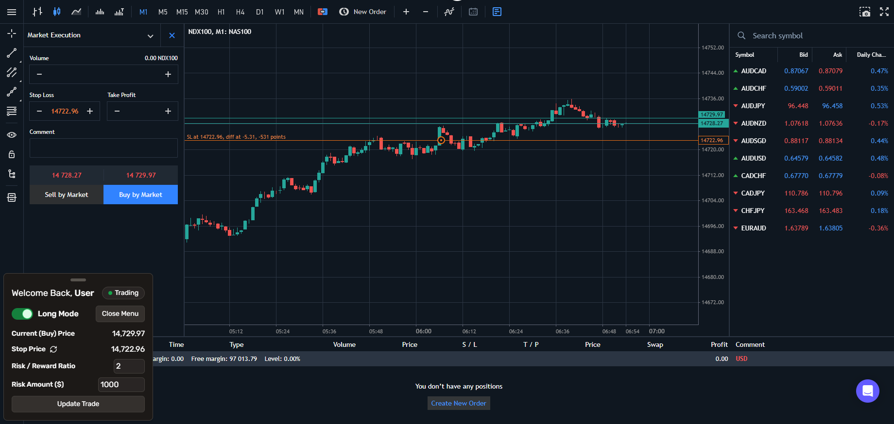
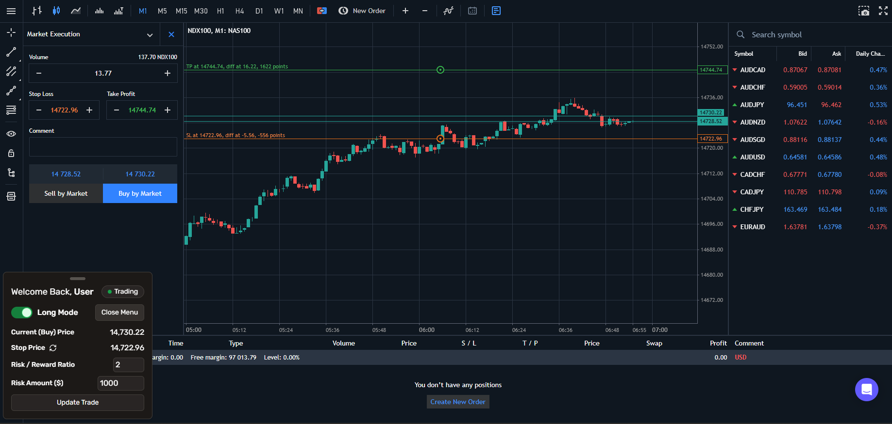
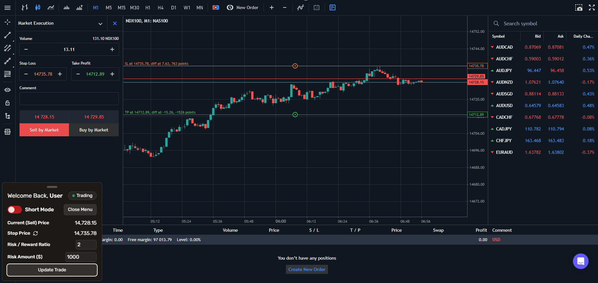
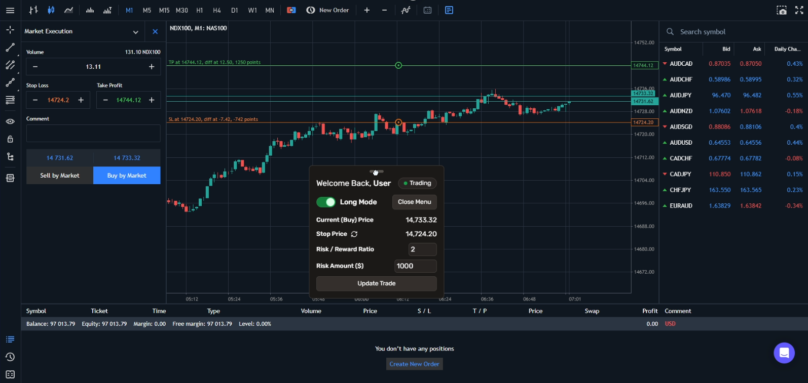

<div align="center">
  
  <h1>Trading Helper</h1>
  <p>A Chrome extension for automating Lot Size and Take Profit calculations based on your trading parameters for smarter risk management.</p>
</div>

---

## Table of Contents

- [Screenshots](#screenshots)
- [Description](#description)
- [Features](#features)
- [Technology Stack](#technology-stack)
- [Build Instructions](#build-instructions)
- [Installation](#installation)
- [License](#license)

## Screenshots







---

## Description

Trading Helper is a Chrome extension designed to simplify your trading strategy by automating essential calculations. With this extension, you can effortlessly set your Lot Size and Take Profit levels based on your specified Stop Loss, Risk/Reward Ratio, and desired $ Risk Amount. Take the guesswork out of trading and ensure your risk management is on point with Trading Helper.

Currently only supported on the [FundedNext Trading Platform](https://fundednext.com/).

## Features

- **Customizable Risk Management**: Tailor your trading strategy by setting Stop Loss, Risk/Reward Ratio, and dollar Risk Amount.
- **Automated Calculations**: Save time and reduce trading errors with automatic Lot Size and Take Profit calculations.
- **Long and Short Modes**: Seamlessly switch between Long and Short modes, automatically adjusting Stop Loss and Take Profit levels based on the appropriate price and mode.
- **Movable Window**: Use the top bar to drag the window anywhere on the screen for improved usability.
- **Effortless Integration**: Seamlessly integrate Trading Helper into Chrome for a hassle-free trading experience.

Enhance your trading strategy and take control of your risk management with Trading Helper, the essential tool for traders of all levels.

## Technology Stack

- **Manifest Version 3**: Uses the latest Chrome extension platform and features.
- **TypeScript**: Enforces static typing in the project, enhancing developer experience and code quality.
- **React**: Uses React to create responsive and interactive user interfaces.
- **Vite**: Utilizes Vite for fast development and building.
- **Nodemon**: Uses automatic project rebuilding during development for fast iteration.
- **Tailwind CSS**: The best styling and customization tool out there.
- **ESLint and Prettier**: Ensured code quality and formatting consistency.

## Build Instructions

1. Install [Node.js](https://nodejs.org/en/download/).

> [!NOTE]  
> The included lockfile is for [pnpm](https://pnpm.io/), but you can use npm or yarn if you prefer.

1. Clone the repository:
   ```bash
   git clone https://github.com/KirillTregubov/trading-helper.git
   cd trading-helper
   ```

1. Create an `.env.local` file in the root directory with the following contents:

   ```bash
   VITE_LOGIN="" # Your FundedNext Log In
   VITE_PASSWORD="" # Your FundedNext Master Password
   VITE_NAME="" # Your Name
   ```

1. Install dependencies:

   ```bash
   npm install
   ```

1. Build the extension:

   ```bash
   npm run build
   ```

### Development

- Run the development server:

   ```bash
   npm run dev
   ```

- Run the linter and formatter:

   ```bash
   npm run lint
   ```

## Installation

Load the extension in Chrome:

1. Open Chrome and navigate to chrome://extensions/.
1. Enable "Developer mode" in the top-right corner.
1. Click "Load unpacked" in the top-left corner, and select the generated `dist` directory.

## License
This project is licensed under the GNU GPLv3 License - see the [COPYING](COPYING) file for details.

<div align="right">(<a href="#readme-top">back to top</a>)</div>